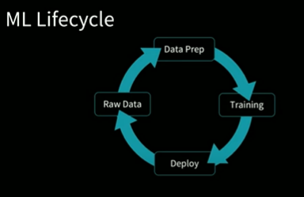
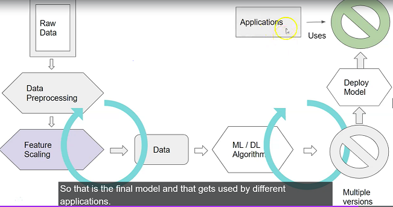

**Seldon** :- Seldon moves machine learning from POC to production to scale, reducing time-to-value so models can get to work up to 85% quicker. In this rapidly changing environment, Seldon can give you the edge you need to supercharge your performance.

With Seldon Deploy, your business can efficiently manage and monitor machine learning, minimise risk, and understand how machine learning models impact decisions and business processes. Meaning you know your team has done its due diligence in creating a more equitable system while boosting performance.

**mlflow** :- a platform to complete machine learning lifecycle.

## ML Lifecycle

---
## Model :-     
  * data -> Machine Learning -> Model
  * new data -> Model -> Prediction
  * In machine learning, we read patterns from data using machine learning algorithm and then create a model. Then we use that model to predict output for new data.
  * Model can be a class/object/Mathematical Formula.
  * Model Deployment options
    * Model can be stored in the file system in binary format, 
    * it can be stored in a database column, 
    * or we can create a Rest Api and make it accessible to applications over http protocol. 
    * Or you can take the model code and use it in another program.
---

* ## How do we create a Model?
  
  

  * the algorithm looks at the data, derives pattern and creates a model.
  * flow of model creation.
    * Raw data - we collect raw data.
    * Data preprocessing -
      *  involves steps like data cleansing, data standardization, fixing issues with null values, missing records, unknown values and various other things.
      * We also convert categorical values to numerical values because ML models can work with numerical data.
      * this is performed by specialized team like big data spark
    * Feature Scaling -
      * bringing all the features to the same scale so that the model will not get biased or influenced by a perticular feature.
    * Data - our data is ready for machine Learning algorithm
    * ML/DL Algorithm -
      * We feed the data to algorithm and get a model
    * Model -
      * once we get a model, we test the accuracy.
      * we fine tune the model to get higher accuracy.
      * if required we go back to the data processing step and generate the data again and feed it to the algorithm again and to get the model with the desired accuracy.
      * We also check wheter the data is overfitting or underfitting.
        * Overfitting: Good performance on the training data, poor generliazation to other data. 
        * Underfitting: Poor performance on the training data and poor generalization to other data
      * once we are happy with the model, we deploy a particular version to production.
    * Poduction Model -
      * This is the final model and this gets used by different appications.
---
* ## Machine Learning Algorithms
  * **Supervised Machine Learning** :-
    * algorithm learns from data, it learns from set of features and the behavior that you are feeding information to it and then predict the output to new set of variables.
    * you tell the algorithm what to look for in a particular dataset.
    * we split data into training data and test data, typically 70 or 80 % for **training** and 30 or 20 % for **testing** the model.
    * There are two types of Supervised ML
      * Classification :- when we are predicting a certain number of classes from the input data
        * eg:- will the person purchase, to recognize it is cat or dog.
      * Regression :- we predict certain values that could be a continuous value (in terms of house price).
  * **UnSupervised Machine Learning** :-
    * Here we feed data to an algorithm but you don't say what to look for.
    * typically we create clusters using unsupervised machine learning
      * eg, age,salary,country,gender, spend amount -> different clusters like young spenders, high income low spenders, high income high spenders. based on this we target the customer for marketing.
---
* ## Spyder environment for development (alternate to vscode)
    * will use Anaconda spyder for ML developement. Download anaconda and install
    * create working directory. open with spyder.

* Python libraries used in Machine Learning to build Model.
  * *numpy* :- for scientific calculations. (matrix type, 2d 3d,etc arrays)
  * *pandas* :- for DataFrame (excel)
  * *matplotlib* :- to add plots
  * *scikit* :- features to use with model (accuracy ,etc.).this is inbuilt library most of the time.

* K-Nearest Neighbor (KNN)
  * *knn algorithm* decides based on the characteristics of their nearest neighbors.
---

* ## Saving Model
  * Python has a technique called "***pickling***" using which you can store python objects in *serialized* or *byte stream format*. In other python env, you can deserialize these objects and use them in your code.
---
* ## Exposing Model over REST API.
  * *REST* stands for REpresentative State Transfer. It is a popular way of exchanging data.
  * You can build your applications in python, java, etc. and if you want to make your application accessible to others you can expose it over REST.
  * Any client who wants to access your application, they would send a request over HTTP protocol using REST and get a response back.
  * Data is typically exchanged in *xml* or *json* format over HTTP protocol.
  * Using **Flask** framework you can easily build a REST API for your python application (model)
    * *Post* :- is common http method, using *post* one can send data to an application and receive a response.
    * we will send data in *json* format and receive it in *json* format.
    * we will pass the model name in the request which will retrieve and display it to the user.
    * While deploying on cloud, change host from *localhost* to *0.0.0.0* and required port no.
---

* ## Deep Learning - Neural Network
  * Deep learning is a sub field of machine learning 
  * Neural Network are the most common category of deep learning algorithm.
    * in traditional ML, we take data and  feed it to an algorithm and then get the output.
    * in neural network, input is received from the input layer, weighted sum is calculated, an activation function is applied in all the neurons and the output is passed to the next layer again,(cycle) goes on, and we get the output. It could be probability for classification models or it could be the actual value in a regression model.
    * **Neuron** is an individual learning unit. 
      * It would read the input parameters and apply an activation function and then get the output.
      * In deep learning, we create many layers of neurons and build a neural network.
      * Each neuron reads the weighted sum of inputs from the previous layer, from all the neurons, applies activation function, and passes output to all the neurons in subsequent layer.
    * **Activation Function** 
      * *RELU (Rectified Linear Unit)* activation is applied in the hidden layer of neural network.
      * *SoftMax Activation* function is applied in the output layer of a classification model.
        * softmax gives the probability of the output.
        * softmax is used with cross entropy loss calculation.
        * cross entropy defines how different two distributions are, the predicted distribution and the actual distribution.
          * low cross entropy means the predicted and the actual values are in sync 
          * classifier tries to minimize the difference between predicted value and the actual value, applying softmax activation function and cross entropy loss 
  * There are several deep learning libraries available to construct neural network. TensorFlow, Keras, PyTorch are some of the popular libraries.
  
* ## Building and deploying PyTorch model
  * google colab-
  

  

